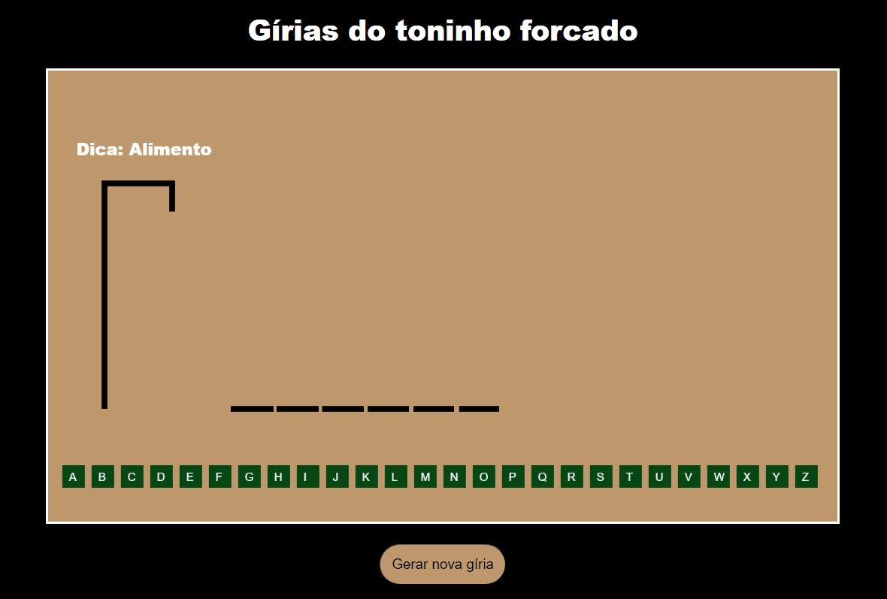
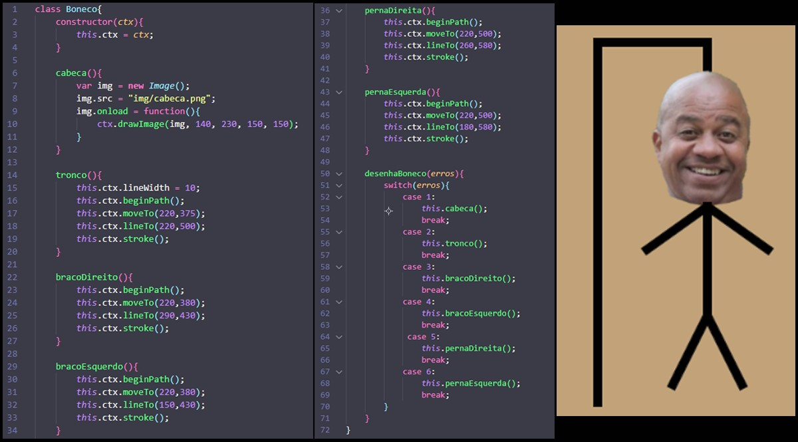
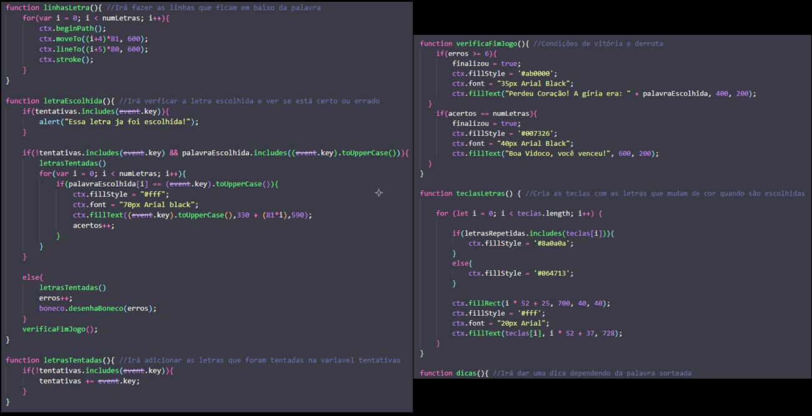
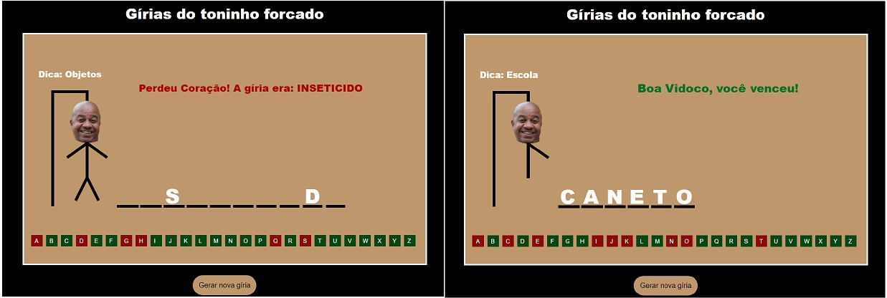
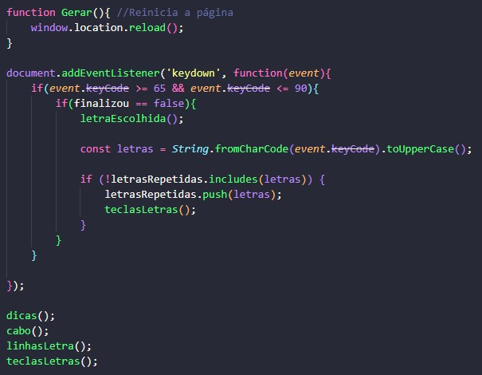
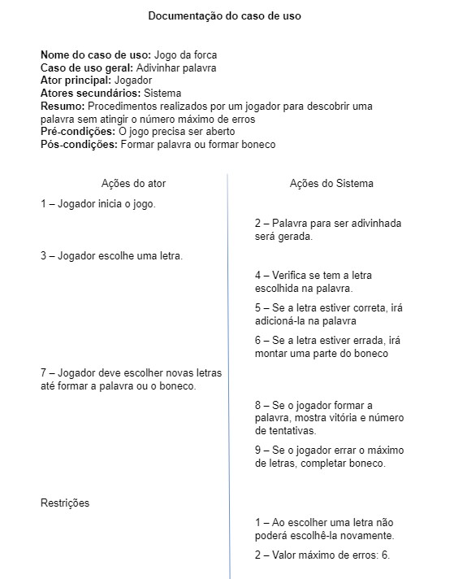
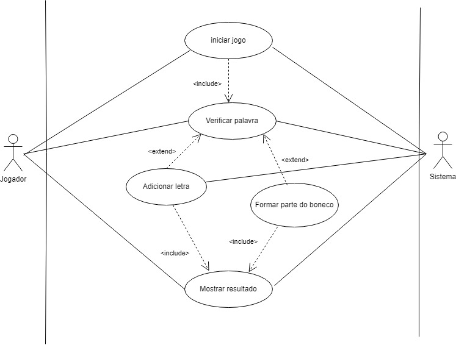
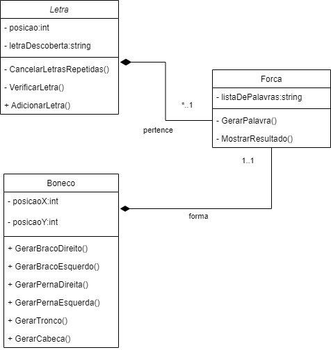
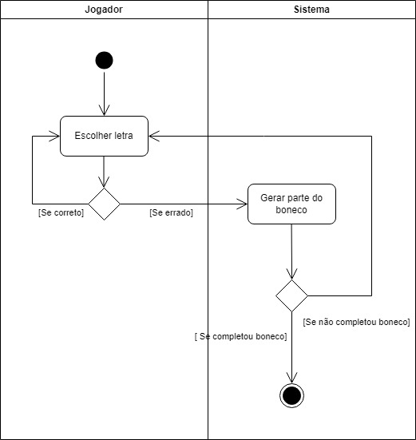

# Jogo da forca

Jogo da forca feito por Cauã Silva e Gabriel Faria 2ºJogos Digitais

# Sobre o jogo da forca

Criamos um jogo da forca inspirado nas gírias do humorista Toninho Tornado, esse jogo seria para aqueles que gostam e acompanham o humorista. As gírias dele se baseiam em palavras comuns, mas a última letra sempre tem que ser a letra "O", por exemplo, cereja ficará cerejo, caneta ficará caneto, calabresa ficará calabreso, samsung ficará samsungo, entre outras diversas gírias.

São 40 gírias diferentes que serão sorteadas para tentar descobri-lá. Para deduzir uma letra da palavra, basta clicar na tecla da letra que você deseja(no seu teclado), se ela estiver na palavra, a letra irá aparecer, se não estiver, uma parte do boneco irá se formar. Possui um conjunto de letras em quadradinhos verde na parte de baixo da tela, toda vez que uma letra for escolhida, o quadradinho da letra que estava verde ficará vermelho.

# Explicação do desenvolvimento

## Classe boneco

Nessa classe está tudo que forma o boneco, sua cabeça(uma imagem do humorista), seu tronco, seus braços e suas pernas, todos feitos com linhas. O método "desenhaBoneco()" serve para desenhar as partes do boneco de acordo com os erros do jogador, se caso ele errar uma vez, desenha a cabeça; duas vezes, o tronco; três vezes, o braço direito; quatro vezes, o braço esquerdo; cinco vezes, a perna direita e seis vezes a perna esquerda.

## Script

No script está tudo relacionado a palavra/letra e as verificações de correto ou errado.

A função "linhasLetra()" é responsável por desenhar as linhas onde irá aparecer as letras da palavra, a sua quantidade vai depender da quantidade de letras das palvaras(numLetras).

A função "letraEscolhida()" verifica se a tecla da letra apertada pelo jogador está correta, errada ou já inclusa nas tentativas(conta como erro). Se estiver correta, a letra da tecla pressionada pelo jogador irá aparecer em sua respectiva posição na linha feita na função "linhasLetra()". Se estiver errado, o método "desenhaBoneco()" será chamado, assim desenhando uma parte do boneco.

A função "letrasTentadas()" é responsável por adicionar as letras ja tentadas pelo jogador na variável tentativas, assim fazendo com que toda vez que ele repita a letra, mostre um alert e conte como erro.

"verificaFimJogo()" irá verificar se o jogador ganhou ou perdeu, com condições de que se os erros forem >= 6, irá aparecer uma mensagem de derrota mostrando qual era a resposta e formará o boneco, e se a quantidade de acertos for igual a quantidade de letras que possui a palavara sorteada, irá aparecer uma mensagem de vitória e formará a palavra.

No final tem a função "Gerar()" que é responsável por reiniciar a página HTML clicando no botão.

Dentro do "document.addEventListenner" possui um if que faz funcionar apenas as teclas que possuem letras no teclado e outro para verificar se o jogo não está finalizado, se estiver, o jogo irá parar de funcionar e será preciso reiniciar a página ou clicar no botão para reiniciar.

Depois foram chamadas as funções que fazem o jogo funcionar.

# Diagramas

## Documentação

## Casos de uso

## Diagrama de classes

## Diagrama de atividades
